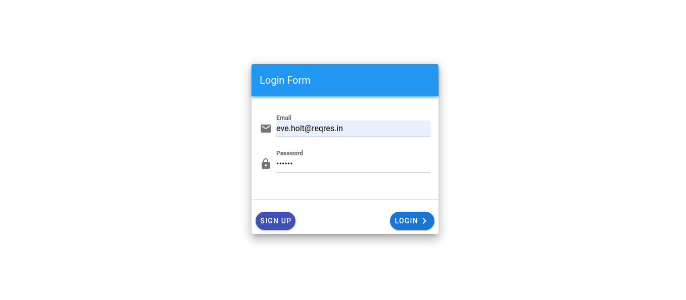
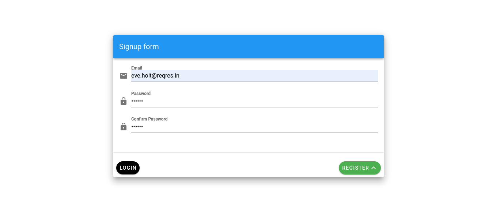
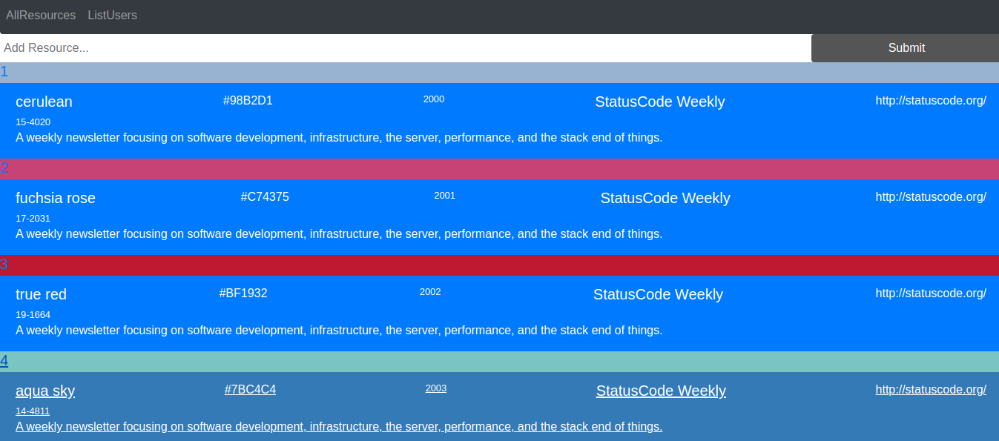
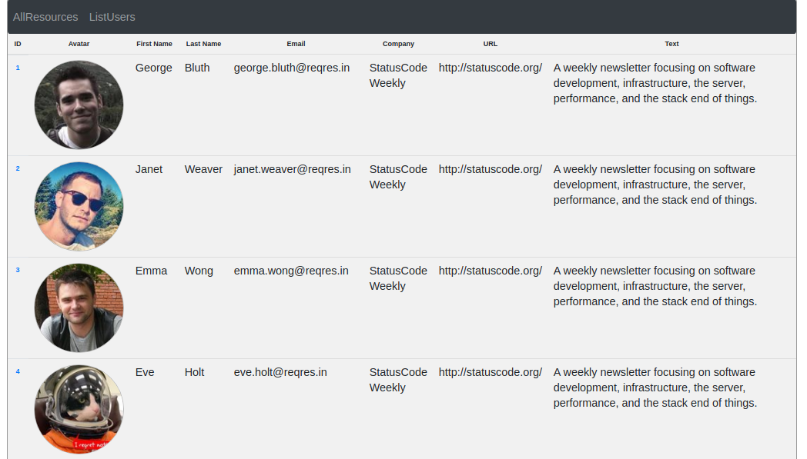

# vue_Task
## How to use this project?

First of all you have to either clone it to you disk or download the zip and the just cd into the project and run npm install to install the mode_nodules necessary for this to work

```
cd project_dir
npm install
npm run serve # run the dev server

```
### Login page


### Sign-up page 


## Resources (First page you see after login in) 


## Users  
