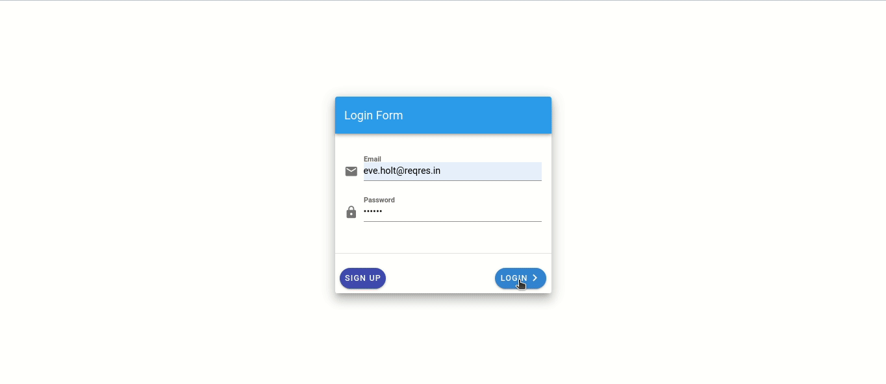

# vue_Project

## Requirements

- [Vue.js](https://vuejs.org) 
- [Vuex](http://vuex.vuejs.org) 
- [Vuetify](https://vuetifyjs.com/)  
- [Axois](https://www.npmjs.com/package/axios)
## Build Commands

All build commands are executed via NPM Scripts.

## How to use this project?
``
First of all you have to either clone it to your disk or download the zip and the just cd into the project and run npm install to install the mode_modules necessary for this to work``

```
cd project_dir
npm install
npm run serve # run the dev server

```
# HTTP Requests Using axios
```
First How to install:
npm install axios
```
# Then import in main.js File
```js
import Vue from "vue";
import App from "./App.vue";
import router from "./router";
import store from "./store";
import axios from "axios";
import "./registerServiceWorker";
import { ServerTable, ClientTable, Event } from "vue-tables-2";
import Vuetify from 'vuetify'
import './plugins/vuetify'
import { BootstrapVue, IconsPlugin } from 'bootstrap-vue'
import 'bootstrap/dist/css/bootstrap.css'
import 'bootstrap-vue/dist/bootstrap-vue.css'

Vue.config.productionTip = false;
Vue.prototype.$axios = axios;
Vue.use(ClientTable);
Vue.use(Vuetify)

axios.defaults.baseURL = 'https://reqres.in/api/';
```

## Project (GIF)


### Login page


### Sign-up page 


## Resources (First page you see after login in) 


## Users  


